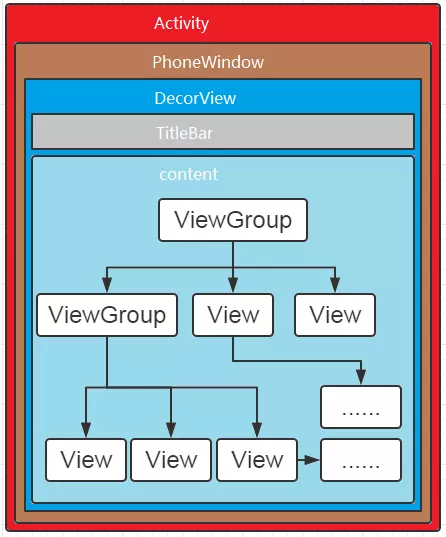
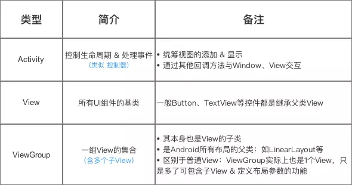
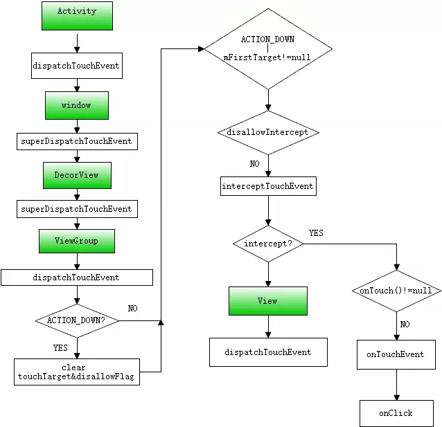

# Android事件分发机制（一）概述

在Android实际开发过程中经常会遇到View之间的滑动冲突，如ScrollView与Listview、RecyclerView之间的嵌套使用。在很好的解决此类问题之前，我们应深入的了解Android事件响应机制。

## 一、基础认知

### 1.1、事件分发的对象是谁？

用户的触摸和点击事件。

#### 定义

当用户触摸屏幕时，将产生点击事件（Touch事件）。Touch事件的相关细节（发生触摸的位置、时间等）被封装成**MotionEvent**对象。

#### 事件类型（4种）

| 事件类型 | 具体动作 |
|:-|:-|
| MotionEvent.ACTION_DOWN | 手指按下屏幕瞬间（所有事件的开始） |
| MotionEvent.ACTION_UP | 手指离开屏幕瞬间（与DOWN对应）|
| MotionEvetn.ACTION_MOVE | 手指在屏幕上移动 |
| MotionEvent.ACTION_CANCEL | 取消手势，一般由程序产生，不会由用户产生 |

#### 事件列
  
从手指接触屏幕至手指离开屏幕，这个过程产生的一系列事件。一般情况下，事件列都是以DOWN事件开始、UP事件结束，中间有无数的MOVE事件。

Android中的事件onClick, onLongClick，onScroll, onFling等等，都是由许多个Touch事件构成的（一个ACTION_DOWN， n个ACTION_MOVE，1个ACTION_UP）。

### 1.2、事件分发的本质

事件分发过程就是对MotionEvent的分发和消费过程。

#### 传递对象：

**Activity、ViewGroup、View**

我们知道，Android的UI界面由Activity、ViewGroup、View及其派生类组成，看下图：





#### 事件源头：

用户触摸屏幕或者按键等时，形成事件，事件经过linux底层Event节点捕获之后，一直传到android应用层。（中间传递的具体过程我也不明白）

#### 传递顺序：

事件传递的顺序：Activity——>ViewGroup——>View

在应用层，首先由Activity进行捕获，进入事件分发处理流程。（因为activity没有事件拦截，View和ViewGroup有）会将事件传递给最外层View的dispatchTouchEvent(MotionEvent ev)方法，该方法对事件进行分发。

### 1.3、事件分发过程由哪些方法协作完成？

#### dispatchTouchEvent(MotionEvent ev)：事件分发

- return true ：表示该View内部消化掉了所有事件。

- return false ：事件在本层不再继续进行分发，并交由上层控件的onTouchEvent方法进行消费（如果本层控件已经是Activity，那么事件将被系统消费或处理）。　

- 如果事件分发返回系统默认的 super.dispatchTouchEvent(ev)，事件将分发给本层的事件拦截onInterceptTouchEvent 方法进行处理

#### onInterceptTouchEvent(MotionEvent ev)：事件拦截

- return true ：表示将事件进行拦截，并将拦截到的事件交由本层控件 的 onTouchEvent 进行处理；

- return false ：则表示不对事件进行拦截，事件得以成功分发到子View。并由子View的dispatchTouchEvent进行处理。　

- 如果返回super.onInterceptTouchEvent(ev)，默认表示拦截该事件，并将事件传递给当前View的onTouchEvent方法，和return true一样。

#### onTouchEvent(MotionEvent ev)：事件响应

在dispatchTouchEvent（事件分发）返回super.dispatchTouchEvent(ev)并且onInterceptTouchEvent（事件拦截返回true或super.onInterceptTouchEvent(ev)的情况下，那么事件会传递到onTouchEvent方法，该方法对事件进行响应。

- 如果return true，表示onTouchEvent处理完事件后消费了此次事件。此时事件终结；

- 如果return fasle，则表示不响应事件，那么该事件将会不断向上层View的onTouchEvent方法传递，直到某个View的onTouchEvent方法返回true，如果到了最顶层View还是返回false，那么认为该事件不消耗，则在同一个事件系列中，当前View无法再次接收到事件，该事件会交由Activity的onTouchEvent进行处理　　

- 如果return super.dispatchTouchEvent(ev)，则表示不响应事件，结果与return false一样。

### 1.4、总结

从以上过程中可以看出，dispatchTouchEvent无论返回true还是false，事件都不再进行分发，只有当其返回super.dispatchTouchEvent(ev)，才表明其具有向下层分发的愿望，但是是否能够分发成功，则需要经过事件拦截onInterceptTouchEvent的审核。事件是否向上传递处理是由onTouchEvent的返回值决定的。



## 二、事件分发机制代码验证

编写一个测试demo，布局文件中用LinearLayout中包含一个Button按钮。依次在每个事件处理方法中，输出log日志。点击按钮测试，通过日志信息分析事件分发流程。

TestLinearLayout.java
```java
public class TestLinearLayout extends LinearLayout {

    private static String TAG="TestLinearLayout";

    public TestLinearLayout(Context context, AttributeSet attrs) {
        super(context, attrs);
    }

    @Override
    public boolean onInterceptTouchEvent(MotionEvent ev) {
        Log.d(TAG, "onInterceptTouchEvent()---action=" + ev.getAction());
        return super.onInterceptTouchEvent(ev);
    }

    @Override
    public boolean dispatchTouchEvent(MotionEvent ev) {
        Log.d(TAG, "dispatchTouchEvent()---action=" + ev.getAction());
        return super.dispatchTouchEvent(ev);
    }

    @Override
    public boolean onTouchEvent(MotionEvent event) {
        Log.d(TAG, "onTouchEvent()---action=" + event.getAction());
        return super.onTouchEvent(event);
    }
}
```

TestButton.java
```java
public class TestButton extends AppCompatButton {

    private static String TAG="TestButton";

    public TestButton(Context context, AttributeSet attrs) {
        super(context, attrs);
    }

    @Override
    public boolean dispatchTouchEvent(MotionEvent event) {
        Log.i(TAG, "dispatchTouchEvent()---action=" + event.getAction());
        return super.dispatchTouchEvent(event);
    }

    @Override
    public boolean onTouchEvent(MotionEvent event) {
        Log.i(TAG, "onTouchEvent()---action=" + event.getAction());
        return super.onTouchEvent(event);
    }
}
```

activity_main.xml
```xml
<com.wqd.app.view.TestLinearLayout
    xmlns:android="http://schemas.android.com/apk/res/android"
    android:layout_width="match_parent"
    android:layout_height="fill_parent"
    android:id="@+id/myLayout"
    android:orientation="vertical">

    <com.wqd.app.view.TestButton
        android:id="@+id/myButton"
        android:text="Click Me"
        android:layout_width="match_parent"
        android:layout_height="wrap_content"/>

</com.wqd.app.view.TestLinearLayout>
```

MainActivity.java
```java
public class MainActivity extends Activity {

    private static String TAG="MainActivity";

    @Override
    protected void onCreate(Bundle savedInstanceState) {
        super.onCreate(savedInstanceState);
        setContentView(R.layout.activity_main);
    }

    @Override
    public boolean dispatchTouchEvent(MotionEvent ev) {
        Log.i(TAG,"---dispatchTouchEvent()---action="+ev.getAction());
        return super.dispatchTouchEvent(ev);
    }

    @Override
    public boolean onTouchEvent(MotionEvent ev) {
        Log.i(TAG,"---onTouchEvent---action="+ev.getAction());
        return super.onTouchEvent(ev);
    }
}
```

打印日志
```
I/MainActivity: ---dispatchTouchEvent()---action=0
I/TestLinearLayout: dispatchTouchEvent()---action=0
I/TestLinearLayout: onInterceptTouchEvent()---action=0
I/TestButton: dispatchTouchEvent()---action=0
I/TestButton: onTouchEvent()---action=0
I/MainActivity: ---dispatchTouchEvent()---action=1
I/TestLinearLayout: dispatchTouchEvent()---action=1
I/TestLinearLayout: onInterceptTouchEvent()---action=1
I/TestButton: dispatchTouchEvent()---action=1
I/TestButton: onTouchEvent()---action=1
```

## 三、总结

从上面的demo中可以测试出事件分发的过程。而事件在Activity、ViewGroup、View传递过程，后面会从源码角度具体分析。

> 参考资料  
> https://juejin.im/entry/597feb6d6fb9a03c5365a38b