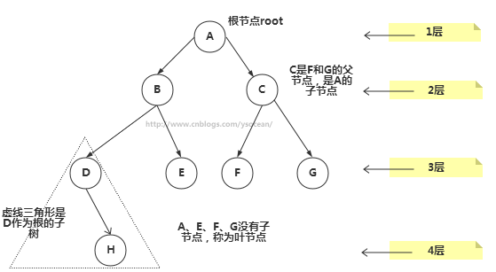
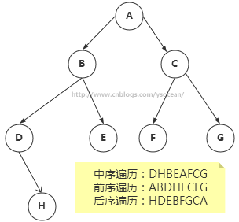
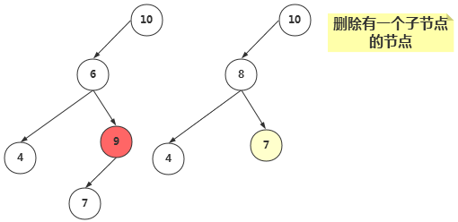
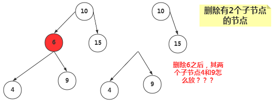

---
title 二叉树
category java数据结构与算法
---

# 二叉树

接下来将会介绍另外一种数据结构——树。二叉树是树这种数据结构的一员，后面还会介绍红黑树，2-3-4树等数据结构。那么为什么要使用树？它有什么优点？

前面介绍数组的时候，知道对于有序数组，查找很快，并介绍可以通过二分法查找，但是想要在有序数组中插入一个数据项，就必须先找到插入数据项的位置，然后将所有插入位置后面的数据项全部向后移动一位，来给新数据腾出空间，平均来讲要移动N/2次，这是很费时的。同理，删除数据也是。

然后介绍了另外一种数据结构——链表，链表的插入和删除很快，只需要改变一些引用值就行了，但是查找数据却很慢了，因为不管查找什么数据，都需要从链表的第一个数据项开始，遍历到找到所需数据项为止，这个查找也是平均需要比较N/2次。

那么我们就希望一种数据结构能同时具备数组查找快的优点以及链表插入和删除快的优点，于是树诞生了。

## 一、树

树（tree）是一种抽象数据类型（ADT），用来模拟具有树状结构性质的数据集合。它是由n（n>0）个有限节点通过连接它们的边组成一个具有层次关系的集合。把它叫做“树”是因为它看起来像一棵倒挂的树，也就是说它是根朝上，而叶朝下的。


1. 节点：上图的圆圈，比较A,B,C等都是表示节点。节点一般代表一些实体，在java面向对像编程中，节点一般代表对象。
2. 边：连接节点的线称为边，边表示节点的关联关系。一般从一个节点到另一个节点的唯一方法就是沿着一条顺着有边的道路前进。在java当中通常表示引用。

树有很多种，向上面的一个节点有多余两个的子节点，称为多路树，后面会介绍2-3-4树和外部存储都是多路树的例子。而每个节点最多只能有两个子节点的一种形式称为二叉树。

树的常用术语：



- 路径：顺着节点的边从一个节点走到另一个节点，所经过的节点的顺序排列就称为“路径”。
- 根：树顶端的节点称为根。一棵树只有一个根，如果要把一个节点和边的集合称为树，那么从根到其他任何一个节点都必须有且只有一条路径。A是根节点。
- 父节点：若一个节点含有子节点，则这个节点称为其子节点的父节点；B是D的父节点。
- 子节点：一个节点含有的子树的根节点称为该节点的子节点；D是B的子节点。
- 兄弟节点：具有相同父节点的节点互称为兄弟节点；比如上图的D和E就互称为兄弟节点。
- 叶节点：没有子节点的节点称为叶节点，也叫叶子节点，比如上图的A、E、F、G都是叶子节点。
- 子树：每个节点都可以作为子树的根，它和它所有的子节点、子节点的子节点等都包含在子树中。
- 节点的层次：从根开始定义，根为第一层，根的子节点为第二层，以此类推。
- 深度：对于任意节点n,n的深度为从根到n的唯一路径长，根的深度为0；
- 高度：对于任意节点n,n的高度为从n到一片树叶的最长路径长，所有树叶的高度为0；

## 二、二叉树

二叉树：树的每个节点最多只能有两个子节点

上图的第一幅图B节点有DEF三个子节点，就不是二叉树，称为多路树；而第二幅图每个节点最多只有两个节点，是二叉树，并且二叉树的子节点称为“左子节点”和“右子节点”。上图的D,E分别是B的左子节点和右子节点。

如果给二叉树加一个额外的条件，就可以得到一种被称作二叉树搜索树（binary search tree）的特殊二叉树。

二叉搜索树要求：若它的左子树不空，则左子树上所有节点的值均小于它的根节点的值；若它的右子树不空，则右子树上所有节点的值均大于它的根结点的值；它的左、右子树也分别为二叉排序树。


二叉搜索树作为一种数据结构，它是如何工作的呢？它查找一个节点，插入一个新节点，以及删除一个节点，遍历树等工作效率如何，下面来一一介绍。

**二叉树的节点类**

```java
public class Node {
    private Object data;    //节点数据
    private Node leftChild; //左子节点的引用
    private Node rightChild; //右子节点的引用
    //打印节点内容
    public void display(){
        System.out.println(data);
    }
 
}
```

**二叉树的具体方法**

```java
public interface Tree {
    //查找节点
    public Node find(Object key);
    //插入新节点
    public boolean insert(Object key);
    //删除节点
    public boolean delete(Object key);
    //Other Method......
}
```

## 三、查找节点

查找某个节点，我们必须从根节点开始遍历。

1. 查找值比当前节点值大，则搜索右子树
2. 查找值等于当前节点值，停止搜索（终止条件）
3. 查找值小于当前节点值，则搜索左子树

```java
//查找节点
public Node find(int key) {
    Node current = root;
    while(current != null){
        if(current.data > key){//当前值比查找值大，搜索左子树
            current = current.leftChild;
        }else if(current.data < key){//当前值比查找值小，搜索右子树
            current = current.rightChild;
        }else{
            return current;
        }
    }
    return null;//遍历完整个树没找到，返回null
}
```

用变量current来保存当前查找的节点，参数key是要查找的值，则刚开始查找将根节点赋值到current。接在while循环中，将要查找的值和current保存的节点进行对比。如果key小于当前节点，则搜索当前节点的左子节点，如果大于，则搜索右子节点，如果等于，则直接返回节点信息。当整个树遍历完全，即current==null,那么说明没找到查找值，返回null。

**树的效率**：查找节点的时间取决于这个节点所在的层数，每一层最多有2<sup>n-1</sup>个节点，总共N层共有2<sup>n</sup>-1节点，那么时间复杂度为O(logn),底数为2。

## 四、插入节点

要插入节点，必须先找到插入的位置。与查找操作相似，由于二叉搜索树的特殊性，待插入的节点也需要从根节点开始进行比较，小于根节点则与根节点左子树比较，反之则与右子树比较，直到左子树为空或右子树为空，则插入到相应为空的位置，在比较的过程中要注意保存父节点的信息及带插入的位置是父节点的左子树还是右子树，才能插入到正确的位置。
```java
//插入节点
public boolean insert(int data) {
    Node newNode = new Node(data);
    //当前树为空树，没有任何节点
    if(root == null){
        root = newNode;
        return true;
    }else{
        Node current = root;
        Node parentNode = null;
        while(current != null){
            parentNode = current;
            if(current.data > data){//当前值比插入值大，搜索左子节点
                current = current.leftChild;
                if(current == null){//左子节点为空，直接将新值插入到该节点
                    parentNode.leftChild = newNode;
                    return true;
                }
            }else{
                current = current.rightChild;
                if(current == null){//右子节点为空，直接将新值插入到该节点
                    parentNode.rightChild = newNode;
                    return true;
                }
            }
        }
    }
    return false;
}
```

## 五、遍历树

遍历树是根据一种特定的顺序访问树的每一个节点。比较常用的有前序遍历，中序遍历和后序遍历。而二叉搜索树最常用的是中序遍历。

1. 中序遍历:左子树——>根节点——>右子树
2. 前序遍历:根节点——>左子树——>右子树
3. 后序遍历:左子树——>右子树——>根节点



```java
//中序遍历
public void infixOrder(Node current){
    if(current != null){
        infixOrder(current.leftChild);
        System.out.print(current.data+" ");
        infixOrder(current.rightChild);
    }
}
 
//前序遍历
public void preOrder(Node current){
    if(current != null){
        System.out.print(current.data+" ");
        preOrder(current.leftChild);
        preOrder(current.rightChild);
    }
}
 
//后序遍历
public void postOrder(Node current){
    if(current != null){
        postOrder(current.leftChild);
        postOrder(current.rightChild);
        System.out.print(current.data+" ");
    }
}
```
## 六、查找最大值和最小值

要找最小值，先找根的左节点，然后一直找这个左节点的左节点，直到找到没有左节点的节点，那么这个节点就是最小值。同理要找最大值，一直找根节点的右节点，直到没有右节点，则就是最大值。

```java
//找到最大值
public Node findMax(){
    Node current = root;
    Node maxNode = current;
    while(current != null){
        maxNode = current;
        current = current.rightChild;
    }
    return maxNode;
}
//找到最小值
public Node findMin(){
    Node current = root;
    Node minNode = current;
    while(current != null){
        minNode = current;
        current = current.leftChild;
    }
    return minNode;
}
```

## 七、删除节点　

删除节点是二叉搜索树中最复杂的操作，删除的节点有三种情况，前两种比较简单，但是第三种却很复杂。

1. 该节点是叶节点（没有子节点）
2. 该节点有一个子节点
3. 该节点有两个子节点

下面我们分别对这三种情况进行讲解。

### 7.1、删除没有子节点的节点

要删除叶节点，只需要改变该节点的父节点引用该节点的值，即将其引用改为 null 即可。要删除的节点依然存在，但是它已经不是树的一部分了，由于Java语言的垃圾回收机制，我们不需要非得把节点本身删掉，一旦Java意识到程序不在与该节点有关联，就会自动把它清理出存储器。


```java
@Override
public boolean delete(int key) {
    Node current = root;
    Node parent = root;
    boolean isLeftChild = false;
    //查找删除值，找不到直接返回false
    while(current.data != key){
        parent = current;
        if(current.data > key){
            isLeftChild = true;
            current = current.leftChild;
        }else{
            isLeftChild = false;
            current = current.rightChild;
        }
        if(current == null){
            return false;
        }
    }
    //如果当前节点没有子节点
    if(current.leftChild == null && current.rightChild == null){
        if(current == root){
            root = null;
        }else if(isLeftChild){
            parent.leftChild = null;
        }else{
            parent.rightChild = null;
        }
        return true;
    }
    return false;
}
```
删除节点，要先找到该节点，并记录该节点的父节点。在检查该节点是否有子节点。如果没有子节点，接着检查其是否是根节点，如果是根节点，只需要将其设置为null即可。如果不是根节点，是叶节点，那么断开父节点和其的关系即可。

### 7.1、删除有一个子节点的节点

删除有一个子节点的节点，我们只需要将其父节点原本指向该节点的引用，改为指向该节点的子节点即可。



```java
//当前节点有一个子节点
if(current.leftChild == null && current.rightChild != null){
    if(current == root){
        root = current.rightChild;
    }else if(isLeftChild){
        parent.leftChild = current.rightChild;
    }else{
        parent.rightChild = current.rightChild;
    }
    return true;
}else{
    //current.leftChild != null && current.rightChild == null
    if(current == root){
        root = current.leftChild;
    }else if(isLeftChild){
        parent.leftChild = current.leftChild;
    }else{
        parent.rightChild = current.leftChild;
    }
    return true;
}
```

### 7.3、删除有两个子节点的节点



当删除的节点存在两个子节点，那么删除之后，两个子节点的位置我们就没办法处理了。既然处理不了，我们就想到一种办法，用另一个节点来代替被删除的节点，那么用哪一个节点来代替呢？

二叉搜索树中的节点是按照关键字来进行排列的，某个节点的关键字次高节点是它的中序遍历后继节点。用后继节点来代替删除的节点，显然该二叉搜索树还是有序的。（这里用后继节点代替，如果该后继节点自己也有子节点，我们后面讨论。）


那么如何找到删除节点的中序后继节点呢？其实稍微分析，这实际上就是要找比删除节点关键值大的节点集合中最小的一个节点，只有这样代替删除节点后才能满足二叉搜索树的特性。

后继节点也就是：比删除节点大的最小节点。

算法：程序找到删除节点的右节点，(注意这里前提是删除节点存在左右两个子节点，如果不存在则是删除情况的前面两种)，然后转到该右节点的左子节点，依次顺着左子节点找下去，最后一个左子节点即是后继节点；如果该右节点没有左子节点，那么该右节点便是后继节点。


需要确定后继节点没有子节点，如果后继节点存在子节点，那么又要分情况讨论了。

1. 后继节点是删除节点的右子节点

这种情况简单，只需要将后继节点表示的子树移到被删除节点的位置即可！


2. 后继节点是删除节点的右子节点的左子节点


```java
public Node getSuccessor(Node delNode){
    Node successorParent = delNode;
    Node successor = delNode;
    Node current = delNode.rightChild;
    while(current != null){
        successorParent = successor;
        successor = current;
        current = current.leftChild;
    }
    //将后继节点替换删除节点
    if(successor != delNode.rightChild){
        successorParent.leftChild = successor.rightChild;
        successor.rightChild = delNode.rightChild;
    }
     
    return successor;
}
```

### 7.4、删除有必要吗？

 通过上面的删除分类讨论，发现删除其实是挺复杂的，那么其实可以不用真正的删除该节点，只需要在Node类中增加一个标识字段isDelete，当该字段为true时，表示该节点已经删除，反正没有删除。那么我们在做比如find()等操作的时候，要先判断isDelete字段是否为true。这样删除的节点并不会改变树的结构。

 ```java
 public class Node {
    int data;   //节点数据
    Node leftChild; //左子节点的引用
    Node rightChild; //右子节点的引用
    boolean isDelete;//表示节点是否被删除
}
 ```

 ## 八、二叉树的效率

 从前面的大部分对树的操作来看，都需要从根节点到下一层一层的查找。

一颗满树，每层节点数大概为2，那么最底层的节点个数比树的其它节点数多1，因此，查找、插入或删除节点的操作大约有一半都需要找到底层的节点，另外四分之一的节点在倒数第二层，依次类推。

总共N层共有2<sup>n</sup>-1个节点，那么时间复杂度为O(logn),底数为2。

在有1000000 个数据项的无序数组和链表中，查找数据项平均会比较500000 次，但是在有1000000个节点的二叉树中，只需要20次或更少的比较即可。

有序数组可以很快的找到数据项，但是插入数据项的平均需要移动 500000 次数据项，在 1000000 个节点的二叉树中插入数据项需要20次或更少比较，在加上很短的时间来连接数据项。

同样，从 1000000 个数据项的数组中删除一个数据项平均需要移动 500000 个数据项，而在 1000000 个节点的二叉树中删除节点只需要20次或更少的次数来找到他，然后在花一点时间来找到它的后继节点，一点时间来断开节点以及连接后继节点。

所以，树对所有常用数据结构的操作都有很高的效率。

遍历可能不如其他操作快，但是在大型数据库中，遍历是很少使用的操作，它更常用于程序中的辅助算法来解析算术或其它表达式。

## 九、用数组表示树

用数组表示树，那么节点是存在数组中的，节点在数组中的位置对应于它在树中的位置。下标为 0 的节点是根，下标为 1 的节点是根的左子节点，以此类推，按照从左到右的顺序存储树的每一层。


树中的每个位置，无论是否存在节点，都对应于数组中的一个位置，树中没有节点的在数组中用0或者null表示。

假设节点的索引值为index，那么节点的左子节点是 2*index+1，节点的右子节点是 2*index+2，它的父节点是 （index-1）/2。

在大多数情况下，使用数组表示树效率是很低的，不满的节点和删除掉的节点都会在数组中留下洞，浪费存储空间。更坏的是，删除节点如果要移动子树的话，子树中的每个节点都要移到数组中新的位置，这是很费时的。

不过如果不允许删除操作，数组表示可能会很有用，尤其是因为某种原因要动态的为每个字节分配空间非常耗时。

## 十、完整的BinaryTree代码

Node.java
```java
public class Node {
    int data;   //节点数据
    Node leftChild; //左子节点的引用
    Node rightChild; //右子节点的引用
    boolean isDelete;//表示节点是否被删除
     
    public Node(int data){
        this.data = data;
    }
    //打印节点内容
    public void display(){
        System.out.println(data);
    }
 
}
```

Tree.java
```java
public interface Tree {
    //查找节点
    public Node find(int key);
    //插入新节点
    public boolean insert(int data);
     
    //中序遍历
    public void infixOrder(Node current);
    //前序遍历
    public void preOrder(Node current);
    //后序遍历
    public void postOrder(Node current);
     
    //查找最大值
    public Node findMax();
    //查找最小值
    public Node findMin();
     
    //删除节点
    public boolean delete(int key);
     
    //Other Method......
}
```

BinaryTree.java
```java
public class BinaryTree implements Tree {
    //表示根节点
    private Node root;
 
    //查找节点
    public Node find(int key) {
        Node current = root;
        while(current != null){
            if(current.data > key){//当前值比查找值大，搜索左子树
                current = current.leftChild;
            }else if(current.data < key){//当前值比查找值小，搜索右子树
                current = current.rightChild;
            }else{
                return current;
            }
        }
        return null;//遍历完整个树没找到，返回null
    }
 
    //插入节点
    public boolean insert(int data) {
        Node newNode = new Node(data);
        if(root == null){//当前树为空树，没有任何节点
            root = newNode;
            return true;
        }else{
            Node current = root;
            Node parentNode = null;
            while(current != null){
                parentNode = current;
                if(current.data > data){//当前值比插入值大，搜索左子节点
                    current = current.leftChild;
                    if(current == null){//左子节点为空，直接将新值插入到该节点
                        parentNode.leftChild = newNode;
                        return true;
                    }
                }else{
                    current = current.rightChild;
                    if(current == null){//右子节点为空，直接将新值插入到该节点
                        parentNode.rightChild = newNode;
                        return true;
                    }
                }
            }
        }
        return false;
    }
     
    //中序遍历
    public void infixOrder(Node current){
        if(current != null){
            infixOrder(current.leftChild);
            System.out.print(current.data+" ");
            infixOrder(current.rightChild);
        }
    }
     
    //前序遍历
    public void preOrder(Node current){
        if(current != null){
            System.out.print(current.data+" ");
            infixOrder(current.leftChild);
            infixOrder(current.rightChild);
        }
    }
     
    //后序遍历
    public void postOrder(Node current){
        if(current != null){
            infixOrder(current.leftChild);
            infixOrder(current.rightChild);
            System.out.print(current.data+" ");
        }
    }
    //找到最大值
    public Node findMax(){
        Node current = root;
        Node maxNode = current;
        while(current != null){
            maxNode = current;
            current = current.rightChild;
        }
        return maxNode;
    }
    //找到最小值
    public Node findMin(){
        Node current = root;
        Node minNode = current;
        while(current != null){
            minNode = current;
            current = current.leftChild;
        }
        return minNode;
    }
     
    @Override
    public boolean delete(int key) {
        Node current = root;
        Node parent = root;
        boolean isLeftChild = false;
        //查找删除值，找不到直接返回false
        while(current.data != key){
            parent = current;
            if(current.data > key){
                isLeftChild = true;
                current = current.leftChild;
            }else{
                isLeftChild = false;
                current = current.rightChild;
            }
            if(current == null){
                return false;
            }
        }
        //如果当前节点没有子节点
        if(current.leftChild == null && current.rightChild == null){
            if(current == root){
                root = null;
            }else if(isLeftChild){
                parent.leftChild = null;
            }else{
                parent.rightChild = null;
            }
            return true;
             
            //当前节点有一个子节点，右子节点
        }else if(current.leftChild == null && current.rightChild != null){
            if(current == root){
                root = current.rightChild;
            }else if(isLeftChild){
                parent.leftChild = current.rightChild;
            }else{
                parent.rightChild = current.rightChild;
            }
            return true;
            //当前节点有一个子节点，左子节点
        }else if(current.leftChild != null && current.rightChild == null){
            if(current == root){
                root = current.leftChild;
            }else if(isLeftChild){
                parent.leftChild = current.leftChild;
            }else{
                parent.rightChild = current.leftChild;
            }
            return true;
        }else{
            //当前节点存在两个子节点
            Node successor = getSuccessor(current);
            if(current == root){
                successor = root;
            }else if(isLeftChild){
                parent.leftChild = successor;
            }else{
                parent.rightChild = successor;
            }
            successor.leftChild = current.leftChild;
        }
        return false;
         
    }
 
    public Node getSuccessor(Node delNode){
        Node successorParent = delNode;
        Node successor = delNode;
        Node current = delNode.rightChild;
        while(current != null){
            successorParent = successor;
            successor = current;
            current = current.leftChild;
        }
        //后继节点不是删除节点的右子节点，将后继节点替换删除节点
        if(successor != delNode.rightChild){
            successorParent.leftChild = successor.rightChild;
            successor.rightChild = delNode.rightChild;
        }
         
        return successor;
    }
     
    public static void main(String[] args) {
        BinaryTree bt = new BinaryTree();
        bt.insert(50);
        bt.insert(20);
        bt.insert(80);
        bt.insert(10);
        bt.insert(30);
        bt.insert(60);
        bt.insert(90);
        bt.insert(25);
        bt.insert(85);
        bt.insert(100);
        bt.delete(10);//删除没有子节点的节点
        bt.delete(30);//删除有一个子节点的节点
        bt.delete(80);//删除有两个子节点的节点
        System.out.println(bt.findMax().data);
        System.out.println(bt.findMin().data);
        System.out.println(bt.find(100));
        System.out.println(bt.find(200));
         
    }
 
}
```

## 十一、总结

树是由边和节点构成，根节点是树最顶端的节点，它没有父节点；二叉树中，最多有两个子节点；某个节点的左子树每个节点都比该节点的关键字值小，右子树的每个节点都比该节点的关键字值大，那么这种树称为二叉搜索树，其查找、插入、删除的时间复杂度都为logN；可以通过前序遍历、中序遍历、后序遍历来遍历树，前序是根节点-左子树-右子树，中序是左子树-根节点-右子树，后序是左子树-右子树-根节点；删除一个节点只需要断开指向它的引用即可；哈夫曼树是二叉树，用于数据压缩算法，最经常出现的字符编码位数最少，很少出现的字符编码位数多一些。