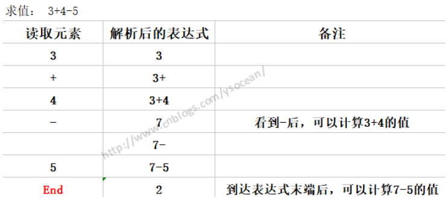
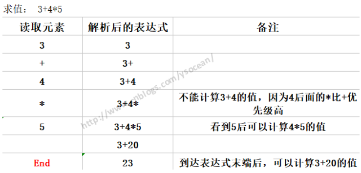
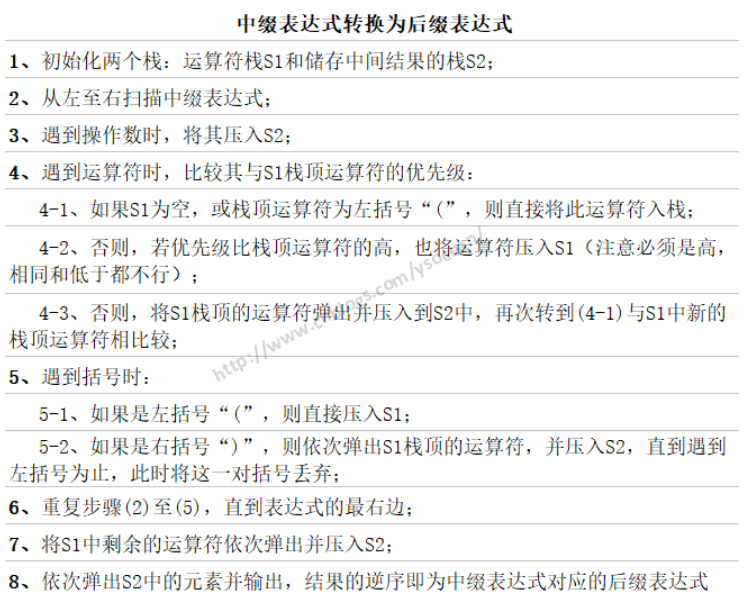
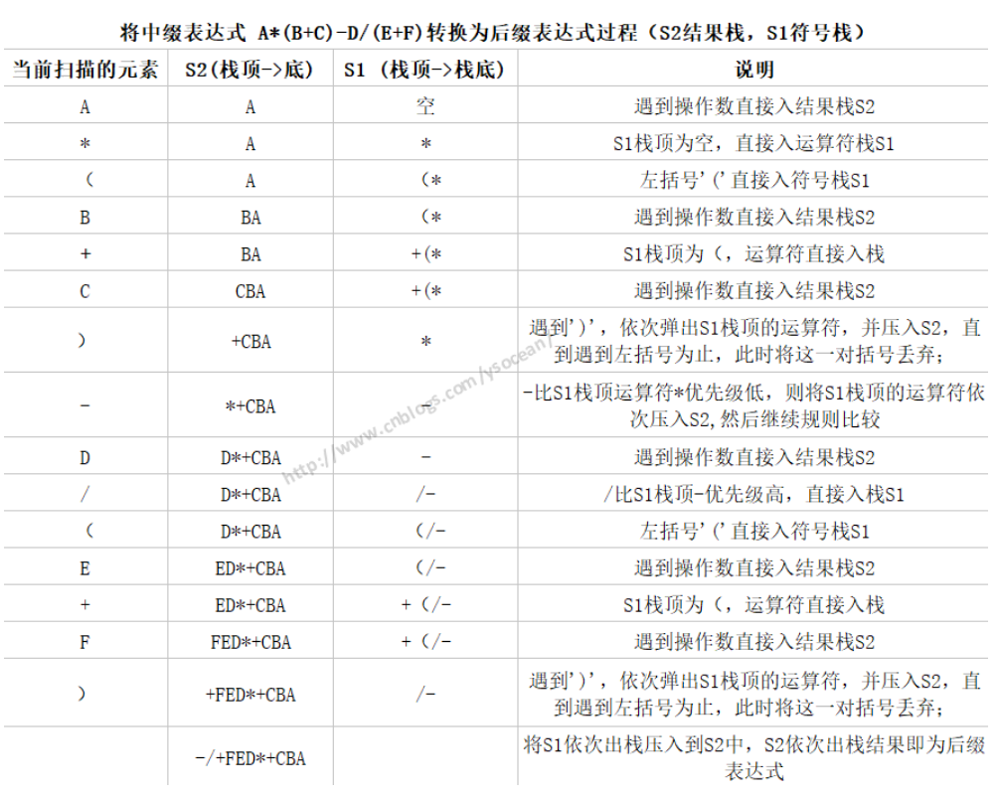
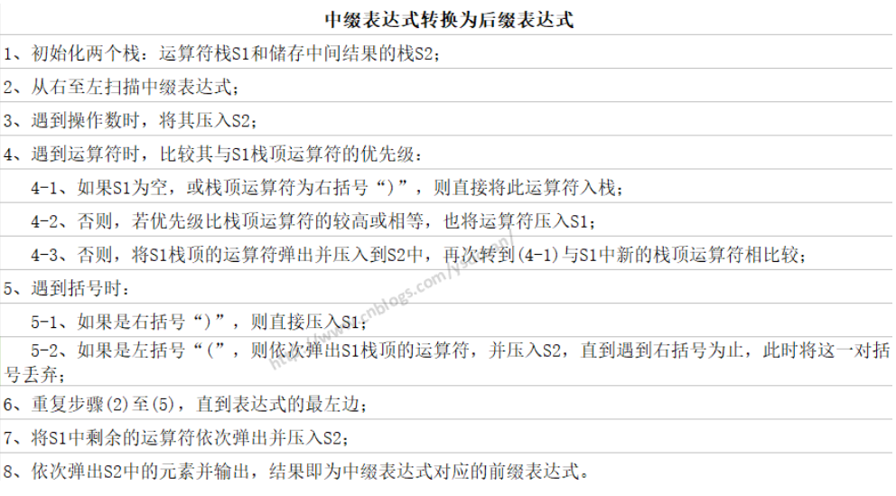

---
title 前缀、中缀和后缀的表达式
category java数据结构与算法
---

# 前缀、中缀和后缀的表达式

前面介绍了三种数据结构，第一种数组主要用作数据存储，但是后面的两种栈和队列主要作为程序功能实现的辅助工具，其中在介绍栈时知道栈可以用来做单词逆序，匹配关键字符等等，那它还有别的什么功能吗？以及数据结构与本篇博客的主题前缀、中缀、后缀表达式有什么关系呢？

## 一、人如何解析算术表达式

如何解析算术表达式？或者换种说法，遇到某个算术表达式，我们是如何计算的：
1. 求值3+4+5



这个表达式，在看到3+4后都不能直接计算3+4的值，知道看到4后面的-号，因为减号的优先级和前面的加号一样，所以可以计算3+4的值了，如果4后面是*或者/，那么就要在乘除过后才能做加法操作，比如：

2. 求值3+4*5



这个不能先求3+4的值，因为4后面的*运算级别比前面的+高。通过这两个表达式的说明，可以总结解析表达式的时候遵循的几条规则：

- 从左到右读取算式。
- 已经读到了可以计算值的两个操作数和一个操作符时，可以计算，并用计算结果代替那两个操作数和一个操作符。
- 继续这个过程，从左到右，能算就算，直到表达式的结尾。

## 二、计算机如何解析算术表达式

对于前面的表达式 3+4-5，人是有思维能力的，能根据操作符的位置，以及操作符的优先级别能算出该表达式的结果。但是计算机怎么算？

计算机必须要向前（从左到右）来读取操作数和操作符，等到读取足够的信息来执行一个运算时，找到两个操作数和一个操作符进行运算，有时候如果后面是更高级别的操作符或者括号时，就必须推迟运算，必须要解析到后面级别高的运算，然后回头来执行前面的运算。我们发现这个过程是极其繁琐的，而计算机是一个机器，只认识高低电平，想要完成一个简单表达式的计算，我们可能要设计出很复杂的逻辑电路来控制计算过程，那更不用说很复杂的算术表达式，所以这样来解析算术表达式是不合理的，那么我们应该采取什么办法呢？

请先看看什么是前缀表达式，中缀表达式，后缀表达式：这三种表达式其实就是算术表达式的三种写法，以 3+4-5为例

**前缀表达式**：操作符在操作数的前面，比如 +-543

**中缀表达式**：操作符在操作数的中间，这也是人类最容易识别的算术表达式 3+4-5

**后缀表达式**：操作符在操作数的后面，比如 34+5-

上面讲的人是如何解析算术表达式的，也就是解析中缀表达式，这是人最容易识别的，但是计算机不容易识别，计算机容易识别的是前缀表达式和后缀表达式，将中缀表达式转换为前缀表达式或者后缀表达式之后，计算机能很快计算出表达式的值，那么中缀表达式是如何转换为前缀表达式和后缀表达式，以及计算机是如何解析前缀表达式和后缀表达式来得到结果的呢？ 

## 三、后缀表达式

后缀表达式，指的是不包含括号，运算符放在两个运算对象的后面，所有的计算按运算符出现的顺序，严格从左向右进行（不再考虑运算符的优先规则）。

由于后缀表达式的运算符在两个操作数的后面，那么计算机在解析后缀表达式的时候，只需要从左向右扫描，也就是只需要向前扫描，而不用回头扫描，遇到运算符就将运算符放在前面两个操作符的中间（这里先不考虑乘方类似的单目运算），一直运算到最右边的运算符，那么就得出运算结果了。既然后缀表达式这么好，那么问题来了：

### 3.1、如何将中缀表达式转换为后缀表达式？
    
对于这个问题，转换的规则如下：



先自定义一个栈

```java
public class MyCharStack {
    private char[] array;
    private int maxSize;
    private int top;
     
    public MyCharStack(int size){
        this.maxSize = size;
        array = new char[size];
        top = -1;
    }
     
    //压入数据
    public void push(char value){
        if(top < maxSize-1){
            array[++top] = value;
        }
    }
     
    //弹出栈顶数据
    public char pop(){
        return array[top--];
    }
     
    //访问栈顶数据
    public char peek(){
        return array[top];
    }
     
    //查看指定位置的元素
    public char peekN(int n){
        return array[n];
    }
     
    //为了便于后面分解展示栈中的内容，我们增加了一个遍历栈的方法(实际上栈只能访问栈顶元素的)
    public void displayStack(){
        System.out.print("Stack(bottom-->top):");
        for(int i = 0 ; i < top+1; i++){
            System.out.print(peekN(i));
            System.out.print(' ');
        }
        System.out.println("");
    }
     
    //判断栈是否为空
    public boolean isEmpty(){
        return (top == -1);
    }
     
    //判断栈是否满了
    public boolean isFull(){
        return (top == maxSize-1);
    }
}
```

前缀表达式转换为后缀表达

```java
public class InfixToSuffix {
    private MyCharStack s1;//定义运算符栈
    private MyCharStack s2;//定义存储结果栈
    private String input;
     
    //默认构造方法，参数为输入的中缀表达式
    public InfixToSuffix(String in){
        input = in;
        s1 = new MyCharStack(input.length());
        s2 = new MyCharStack(input.length());
    }
    //中缀表达式转换为后缀表达式，将结果存储在栈中返回，逆序显示即后缀表达式
    public MyCharStack doTrans(){
        for(int j = 0 ; j < input.length() ; j++){
            System.out.print("s1栈元素为：");
            s1.displayStack();
            System.out.print("s2栈元素为：");
            s2.displayStack();
            char ch = input.charAt(j);
            System.out.println("当前解析的字符:"+ch);
            switch (ch) {
            case '+':
            case '-':
                gotOper(ch,1);
                break;
            case '*':
            case '/':
                gotOper(ch,2);
                break;
            case '(':
                s1.push(ch);//如果当前字符是'(',则将其入栈
                break;
            case ')':
                gotParen(ch);
                break;
            default:
                //1、如果当前解析的字符是操作数，则直接压入s2
                //2、
                s2.push(ch);
                break;
            }//end switch
        }//end for
         
        while(!s1.isEmpty()){
            s2.push(s1.pop());
        }
        return s2;
    }
     
    public void gotOper(char opThis,int prec1){
        while(!s1.isEmpty()){
            char opTop = s1.pop();
            if(opTop == '('){//如果栈顶是'(',直接将操作符压入s1
                s1.push(opTop);
                break;
            }else{
                int prec2;
                if(opTop == '+' || opTop == '-'){
                    prec2 = 1;
                }else{
                    prec2 = 2;
                }
                if(prec2 < prec1){//如果当前运算符比s1栈顶运算符优先级高，则将运算符压入s1
                    s1.push(opTop);
                    break;
                }else{//如果当前运算符与栈顶运算符相同或者小于优先级别，那么将S1栈顶的运算符弹出并压入到S2中
                    //并且要再次再次转到while循环中与 s1 中新的栈顶运算符相比较；
                    s2.push(opTop);
                }
            }
             
        }//end while
        //如果s1为空，则直接将当前解析的运算符压入s1
        s1.push(opThis);
    }
     
    //当前字符是 ')' 时，如果栈顶是'(',则将这一对括号丢弃，否则依次弹出s1栈顶的字符，压入s2，直到遇到'('
    public void gotParen(char ch){
        while(!s1.isEmpty()){
            char chx = s1.pop();
            if(chx == '('){
                break;
            }else{
                s2.push(chx);
            }
        }
    }
 
}
```

测试：

```java
@Test
public void testInfixToSuffix(){
    String input;
    System.out.println("Enter infix:");
    Scanner scanner = new Scanner(System.in);
    input = scanner.nextLine();
    InfixToSuffix in = new InfixToSuffix(input);
    MyCharStack my = in.doTrans();
    my.displayStack();
}
```

分析：



### 3.2、计算机如何实现后缀表达式的运算？

1. 从左向右扫描
2. 遇到数字，压入栈中
3. 遇到运算符，弹出栈顶的两个数，并用运算符对这两个数做相应的计算，并将结果入栈
4. 重复上述2、3步骤，知道表达式的最右端，最后的值即为表达式的结果

```java
public class CalSuffix {
    private MyIntStack stack;
    private String input;
     
    public CalSuffix(String input){
        this.input = input;
        stack = new MyIntStack(input.length());
         
    }
     
    public int doCalc(){
        int num1,num2,result;
        for(int i = 0 ; i < input.length() ; i++){
            char c = input.charAt(i);
            if(c >= '0' && c <= '9'){
                stack.push((int)(c-'0'));//如果是数字，直接压入栈中
            }else{
                num2 = stack.pop();//注意先出来的为第二个操作数
                num1 = stack.pop();
                switch (c) {
                case '+':
                    result = num1+num2;
                    break;
                case '-':
                    result = num1-num2;
                    break;
                case '*':
                    result = num1*num2;
                    break;
                case '/':
                    result = num1/num2;
                    break;
                default:
                    result = 0;
                    break;
                }//end switch
                 
                stack.push(result);
            }//end else
        }//end for
        result = stack.pop();
        return result;
    }
     
    public static void main(String[] args) {
        //中缀表达式：1*(2+3)-5/(2+3) = 4
        //后缀表达式：123+*123+/-
        CalSuffix cs = new CalSuffix("123+*523+/-");
        System.out.println(cs.doCalc()); //4
    }
 
}
```

## 四、前缀表达式

前缀表达式，指的是不包含括号，运算符放在两个运算对象的前面，严格从右向左进行（不再考虑运算符的优先规则），所有的计算按运算符出现的顺序。

注意：后缀表达式是从左向右解析，而前缀表达式是从右向左解析。

### 4.1、如何将中缀表达式转换为前缀表达式？



### 4.2、计算机如何实现前缀表达式的运算？

1. 从右至左扫描表达式
2. 遇到数字，压入栈中
3. 遇到运算符，弹出栈顶的两个数，并用运算符对这两个数做相应的计算，并将结果入栈
4. 重复上述2、3步骤，知道表达式的最左端，最后的值即为表达式的结果