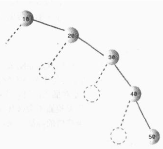
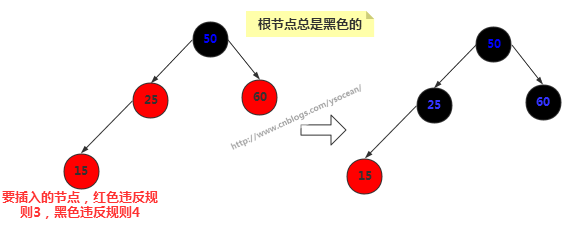
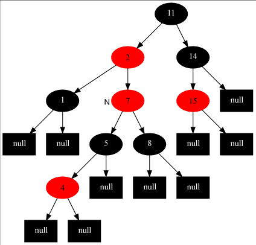
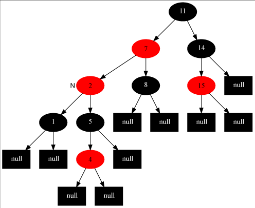

---
title 红黑树
category java数据结构与算法
---

# 红黑树

前面介绍了[二叉搜索树](java数据结构和算法之二叉树.md)，二叉搜索树对于某个节点而言，其左子树的节点关键值都小于该节点关键值，右子树的所有节点关键值都大于该节点关键值。二叉搜索树作为一种数据结构，其查找、插入和删除操作的时间复杂度都为O(logn)，底数为2.但是这个时间复杂度是在平衡的二叉搜索树上体现的，也就是如果插入的数据是随机的，则效率很高，但是如果插入的数据是有序的，比如从小到打的顺序[10,20,30,40,50]插入到二叉搜索树中：



从大到小就是全部在左边，这和链表没有任何区别了，这种情况下查找的时间复杂度为O(N)，而不是O(logN)。当然这是在最不平衡的条件下，实际情况下，二叉搜索树的效率应该在O(N)和O(logN)之间，这取决于树的不平衡程度。

那么为了能够以较快的时间O(logN)来搜索一棵树，我们需要保证树总是平衡的（或者大部分是平衡的），也就是说每个节点的左子树节点个数和右子树节点个数尽量相等。红-黑树的就是这样的一棵平衡树，对一个要插入的数据项（删除也是），插入例程要检查会不会破坏树的特征，如果破坏了，程序就会进行纠正，根据需要改变树的结构，从而保持树的平衡。

## 一、红-黑树的特征

有如下两个特征：

1. 节点都有颜色；
2. 在插入和删除的过程中，要遵循保持这些颜色的不同排列规则。

第一个很好理解，在红-黑树中，每个节点的颜色或者是黑色或者是红色的。当然也可以是任意别的两种颜色，这里的颜色用于标记，我们可以在节点类Node中增加一个boolean型变量isRed，以此来表示颜色的信息。

第二点，在插入或者删除一个节点时，必须要遵守的规则称为红-黑规则：

1. 每个节点不是红色就是黑色的；
2. 根节点总是黑色的；
3. 如果节点是红色的，则它的子节点必须是黑色的（反之不一定）,(也就是从每个叶子到根的所有路径上不能有两个连续的红色节点)；
4. 从根节点到叶节点或空子节点的每条路径，必须包含相同数目的黑色节点（即相同的黑色高度）。

从根节点到叶节点的路径上的黑色节点的数目称为黑色高度，规则 4 另一种表示就是从根到叶节点路径上的黑色高度必须相同。

注意：新插入的节点颜色总是红色的，这是因为插入一个红色节点比插入一个黑色节点违背红-黑规则的可能性更小，原因是插入黑色节点总会改变黑色高度（违背规则4），但是插入红色节点只有一半的机会会违背规则3（因为父节点是黑色的没事，父节点是红色的就违背规则3）。另外违背规则3比违背规则4要更容易修正。当插入一个新的节点时，可能会破坏这种平衡性，那么红-黑树是如何修正的呢？

## 二、红-黑树的自我修正

红-黑树主要通过三种方式对平衡进行修正，改变节点颜色、左旋和右旋。

### 2.1、改变节点颜色



新插入的节点为15，一般新插入颜色都为红色，那么我们发现直接插入会违反规则3，改为黑色却发现违反规则4。这时候我们将其父节点颜色改为黑色，父节点的兄弟节点颜色也改为黑色。通常其祖父节点50颜色会由黑色变为红色，但是由于50是根节点，所以我们这里不能改变根节点颜色。

### 2.2、右旋

首先要说明的是节点本身是不会旋转的，旋转改变的是节点之间的关系，选择一个节点作为旋转的顶端，如果做一次右旋，这个顶端节点会向下和向右移动到它右子节点的位置，它的左子节点会上移到它原来的位置。右旋的顶端节点必须要有左子节点。


### 2.3、左旋

左旋的顶端节点必须要有右子节点。


**注意**：改变颜色也是为了帮助判断何时执行什么旋转，而旋转是为了保证树的平衡。光改变节点颜色是不能起到任何作用的，旋转才是关键的操作，在新增节点或者删除节点之后，可能会破坏二叉树的平衡，那么何时执行旋转以及执行什么旋转，这是我们需要重点关注的。

## 三、左旋和右旋代码

### 3.1、节点类

节点类和二叉树的节点类差不多，只不过在其基础上增加了一个 boolean 类型的变量来表示节点的颜色。

```java
public class RBNode<T extends Comparable<T>> {
    boolean color;//颜色
    T key;//关键值
    RBNode<T> left;//左子节点
    RBNode<T> right;//右子节点
    RBNode<T> parent;//父节点
     
    public RBNode(boolean color,T key,RBNode<T> parent,RBNode<T> left,RBNode<T> right){
        this.color = color;
        this.key = key;
        this.parent = parent;
        this.left = left;
        this.right = right;
    }
     
    //获得节点的关键值
    public T getKey(){
        return key;
    }
    //打印节点的关键值和颜色信息
    public String toString(){
        return ""+key+(this.color == RED ? "R":"B");
    }
}
```

### 3.2、左旋的具体体现

```java
/*************对红黑树节点x进行左旋操作 ******************/
/* 
 * 左旋示意图：对节点x进行左旋 
 *     p                       p 
 *    /                       / 
 *   x                       y 
 *  / \                     / \ 
 * lx  y      ----->       x  ry 
 *    / \                 / \ 
 *   ly ry               lx ly 
 * 左旋做了三件事： 
 * 1. 将y的左子节点赋给x的右子节点,并将x赋给y左子节点的父节点(y左子节点非空时) 
 * 2. 将x的父节点p(非空时)赋给y的父节点，同时更新p的子节点为y(左或右) 
 * 3. 将y的左子节点设为x，将x的父节点设为y 
 */
private void leftRotate(RBNode<T> x){
    //1. 将y的左子节点赋给x的右子节点，并将x赋给y左子节点的父节点(y左子节点非空时)
    RBNode<T> y = x.right;
    x.right = y.left;
    if(y.left != null){
        y.left.parent = x;
    }
     
    //2. 将x的父节点p(非空时)赋给y的父节点，同时更新p的子节点为y(左或右)
    y.parent = x.parent;
    if(x.parent == null){
        this.root = y;//如果x的父节点为空(即x为根节点)，则将y设为根节点
    }else{
        if(x == x.parent.left){//如果x是左子节点
            x.parent.left = y;//则也将y设为左子节点 
        }else{
            x.parent.right = y;//否则将y设为右子节点 
        }
    }
     
    //3. 将y的左子节点设为x，将x的父节点设为y
    y.left = x;
    x.parent = y;
}
```

### 3.3、右旋的具体体现

```java
/*************对红黑树节点y进行右旋操作 ******************/ 
/*
 * 左旋示意图：对节点y进行右旋
 *        p                   p
 *       /                   /
 *      y                   x
 *     / \                 / \
 *    x  ry   ----->      lx  y
 *   / \                     / \
 * lx  rx                   rx ry
 * 右旋做了三件事：
 * 1. 将x的右子节点赋给y的左子节点,并将y赋给x右子节点的父节点(x右子节点非空时)
 * 2. 将y的父节点p(非空时)赋给x的父节点，同时更新p的子节点为x(左或右)
 * 3. 将x的右子节点设为y，将y的父节点设为x
 */
private void rightRotate(RBNode<T> y){
    //1. 将y的左子节点赋给x的右子节点，并将x赋给y左子节点的父节点(y左子节点非空时)
    RBNode<T> x = y.left;
    y.left = x.right;
    if(x.right != null){
        x.right.parent = y;
    }
     
    //2. 将x的父节点p(非空时)赋给y的父节点，同时更新p的子节点为y(左或右)
    x.parent = y.parent;
    if(y.parent == null){
        this.root = x;//如果y的父节点为空(即y为根节点)，则旋转后将x设为根节点
    }else{
        if(y == y.parent.left){//如果y是左子节点
            y.parent.left = x;//则将x也设置为左子节点
        }else{
            y.parent.right = x;//否则将x设置为右子节点
        }
    }
     
    //3. 将x的左子节点设为y，将y的父节点设为y
    x.right = y;
    y.parent = x;
}
```

## 四、插入操作

和二叉树的插入操作一样，都是得先找到插入的位置，然后再将节点插入。先看看插入的前段代码：

```java
/*********************** 向红黑树中插入节点 **********************/
public void insert(T key){
    RBNode<T> node = new RBNode<T>(RED, key, null, null, null);
    if(node != null){
        insert(node);
    }
}
public void insert(RBNode<T> node){
    RBNode<T> current = null;//表示最后node的父节点
    RBNode<T> x = this.root;//用来向下搜索
     
    //1.找到插入位置
    while(x != null){
        current = x;
        int cmp = node.key.compareTo(x.key);
        if(cmp < 0){
            x = x.left;
        }else{
            x = x.right;
        }
    }
    node.parent = current;//找到了插入的位置，将当前current作为node的父节点
     
    //2.接下来判断node是左子节点还是右子节点
    if(current != null){
        int cmp = node.key.compareTo(current.key);
        if(cmp < 0){
            current.left = node;
        }else{
            current.right = node;
        }
    }else{
        this.root = node;
    }
     
    //3.利用旋转操作将其修正为一颗红黑树
    insertFixUp(node);
}
```

这与二叉搜索树中实现的思路一样，这里不再赘述，主要看看方法里面最后一步insertFixUp(node)操作。因为插入后可能会导致树的不平衡，insertFixUp(node) 方法里主要是分情况讨论，分析何时变色，何时左旋，何时右旋。先从理论上分析具体的情况，然后再看insertFixUp(node) 的具体实现。

如果是第一次插入，由于原树为空，所以只会违反红-黑树的规则2，所以只要把根节点涂黑即可；如果插入节点的父节点是黑色的，那不会违背红-黑树的规则，什么也不需要做；但是遇到如下三种情况，我们就要开始变色和旋转了：

1. 插入节点的父节点和其叔叔节点（祖父节点的另一个子节点）均为红色。
2. 插入节点的父节点是红色的，叔叔节点是黑色的，且插入节点是其父节点的右子节点。
3. 插入节点的父节点是红色的，叔叔节点是黑色的，且插入节点是其父节点的左子节点。

下面挨个分析这三种情况都需要如何操作，然后给出实现代码。

在下面的讨论中，使用N,P,G,U表示关联的节点。N(now)表示当前节点，P(parent)表示N的父节点，U(uncle)表示N的叔叔节点，G(grandfather)表示N的祖父节点，也就是P和U的父节点。

对于情况1：插入节点的父节点和其叔叔节点（祖父节点的另一个子节点）均为红色。此时，肯定存在祖父节点，但是不知道父节点是其左子节点还是右子节点，但是由于对称性，我们只要讨论出一边的情况，另一种情况自然也与之对应。这里考虑父节点是其祖父节点的左子节点的情况，如下左图所示：

  

对于这种情况，我们要做的操作有：将当前节点(4) 的父节点(5) 和叔叔节点(8) 涂黑，将祖父节点(7)涂红,变成了上有图所示的情况。再将当前节点指向其祖父节点，再次从新的当前节点开始算法（具体看下面的步骤）。这样上右图就变成情况2了。

  

对于情况2：插入节点的父节点是红色的，叔叔节点是黑色的，且插入节点是其父节点的右子节点。我们要做的操作有：将当前节点(7)的父节点(2)作为新的节点，以新的当前节点为支点做左旋操作。完成后如左下图所示，这样左下图就变成情况3了。

  

对于情况3：插入节点的父节点是红色，叔叔节点是黑色，且插入节点是其父节点的左子节点。要做的操作有：将当前节点的父节点(7)涂黑，将祖父节点(11)涂红，在祖父节点为支点做右旋操作。最后把根节点涂黑，整个红-黑树重新恢复了平衡，如右上图所示。至此，插入操作完成！

可以看出，如果是从情况1开始发生的，必然会走完情况2和3，也就是说这是一整个流程，当然咯，实际中可能不一定会从情况1发生，如果从情况2开始发生，那再走个情况3即可完成调整，如果直接只要调整情况3，那么前两种情况均不需要调整了。故变色和旋转之间的先后关系可以表示为：变色->左旋->右旋。

至此，完成了全部的插入操作。下面看看insertFixUp方法中的具体实现（可以结合上面的分析图，更加利与理解）：

```java
private void insertFixUp(RBNode<T> node){
    RBNode<T> parent,gparent;//定义父节点和祖父节点
     
    //需要修正的条件：父节点存在，且父节点的颜色是红色
    while(((parent = parentOf(node)) != null) && isRed(parent)){
        gparent = parentOf(parent);//获得祖父节点
         
        //若父节点是祖父节点的左子节点，下面的else相反
        if(parent == gparent.left){
            RBNode<T> uncle = gparent.right;//获得叔叔节点
             
            //case1:叔叔节点也是红色
            if(uncle != null && isRed(uncle)){
                setBlack(parent);//把父节点和叔叔节点涂黑
                setBlack(gparent);
                setRed(gparent);//把祖父节点涂红
                node = gparent;//把位置放到祖父节点处
                continue;//继续while循环，重新判断
            }
             
            //case2:叔叔节点是黑色，且当前节点是右子节点
            if(node == parent.right){
                leftRotate(parent);//从父节点出左旋
                RBNode<T> tmp = parent;//然后将父节点和自己调换一下，为下面右旋做准备
                parent = node;
                node = tmp;
            }
             
            //case3:叔叔节点是黑色，且当前节点是左子节点
            setBlack(parent);
            setRed(gparent);
            rightRotate(gparent);
        }else{//若父节点是祖父节点的右子节点，与上面的情况完全相反，本质是一样的
            RBNode<T> uncle = gparent.left;
             
            //case1:叔叔节点也是红色的
            if(uncle != null && isRed(uncle)){
                setBlack(parent);
                setBlack(uncle);
                setRed(gparent);
                node = gparent;
                continue;
            }
             
            //case2:叔叔节点是黑色的，且当前节点是左子节点
            if(node == parent.left){
                rightRotate(parent);
                RBNode<T> tmp = parent;
                parent = node;
                node = tmp;
            }
             
            //case3:叔叔节点是黑色的，且当前节点是右子节点
            setBlack(parent);
            setRed(gparent);
            leftRotate(gparent);
        }
    }
    setBlack(root);//将根节点设置为黑色
}
```

### 五、删除操作

将红黑树内的某一个节点删除。需要执行的操作依次是：首先，将红黑树当作一颗二叉查找树，将该节点从二叉查找树中删除；然后，通过"旋转和重新着色"等一系列来修正该树，使之重新成为一棵红黑树。详细描述如下：

**第一步**：将红黑树当作一颗二叉查找树，将节点删除。

这和"删除常规二叉查找树中删除节点的方法是一样的"。分3种情况：

1. 被删除节点没有儿子，即为叶节点。那么，直接将该节点删除就OK了。
2. 被删除节点只有一个儿子。那么，直接删除该节点，并用该节点的唯一子节点顶替它的位置。
3. 被删除节点有两个儿子。那么，先找出它的后继节点；然后把“它的后继节点的内容”复制给“该节点的内容”；之后，删除“它的后继节点”。在这里，后继节点相当于替身，在将后继节点的内容复制给"被删除节点"之后，再将后继节点删除。这样就巧妙的将问题转换为"删除后继节点"的情况了，下面就考虑后继节点。 在"被删除节点"有两个非空子节点的情况下，它的后继节点不可能是双子非空。既然"的后继节点"不可能双子都非空，就意味着"该节点的后继节点"要么没有儿子，要么只有一个儿子。若没有儿子，则按"情况① "进行处理；若只有一个儿子，则按"情况② "进行处理。
   
```java
/* 
 * 删除结点(node)，并返回被删除的结点
 *
 * 参数说明：
 *     node 删除的结点
 */
private void remove(RBTNode<T> node) {
    RBTNode<T> child, parent;
    boolean color;

    // 被删除节点的"左右孩子都不为空"的情况。
    if ( (node.left!=null) && (node.right!=null) ) {
        // 被删节点的后继节点。(称为"取代节点")
        // 用它来取代"被删节点"的位置，然后再将"被删节点"去掉。
        RBTNode<T> replace = node;

        // 获取后继节点
        replace = replace.right;
        while (replace.left != null)
            replace = replace.left;

        // "node节点"不是根节点(只有根节点不存在父节点)
        if (parentOf(node)!=null) {
            if (parentOf(node).left == node)
                parentOf(node).left = replace;
            else
                parentOf(node).right = replace;
        } else {
            // "node节点"是根节点，更新根节点。
            this.mRoot = replace;
        }

        // child是"取代节点"的右孩子，也是需要"调整的节点"。
        // "取代节点"肯定不存在左孩子！因为它是一个后继节点。
        child = replace.right;
        parent = parentOf(replace);
        // 保存"取代节点"的颜色
        color = colorOf(replace);

        // "被删除节点"是"它的后继节点的父节点"
        if (parent == node) {
            parent = replace;
        } else {
            // child不为空
            if (child!=null)
                setParent(child, parent);
            parent.left = child;

            replace.right = node.right;
            setParent(node.right, replace);
        }

        replace.parent = node.parent;
        replace.color = node.color;
        replace.left = node.left;
        node.left.parent = replace;

        if (color == BLACK)
            removeFixUp(child, parent);

        node = null;
        return ;
    }

    if (node.left !=null) {
        child = node.left;
    } else {
        child = node.right;
    }

    parent = node.parent;
    // 保存"取代节点"的颜色
    color = node.color;

    if (child!=null)
        child.parent = parent;

    // "node节点"不是根节点
    if (parent!=null) {
        if (parent.left == node)
            parent.left = child;
        else
            parent.right = child;
    } else {
        this.mRoot = child;
    }

    if (color == BLACK)
        removeFixUp(child, parent);
    node = null;
}

/* 
 * 删除结点(z)，并返回被删除的结点
 *
 * 参数说明：
 *     tree 红黑树的根结点
 *     z 删除的结点
 */
public void remove(T key) {
    RBTNode<T> node; 

    if ((node = search(mRoot, key)) != null)
        remove(node);
}
```
内部接口 -- remove(node)的作用是将"node"节点插入到红黑树中。

外部接口 -- remove(key)删除红黑树中键值为key的节点。


**第二步**：通过"旋转和重新着色"等一系列来修正该树，使之重新成为一棵红黑树。
        
因为"第一步"中删除节点之后，可能会违背红黑树的特性。所以需要通过"旋转和重新着色"来修正该树，使之重新成为一棵红黑树。

```java
/*
 * 红黑树删除修正函数
 *
 * 在从红黑树中删除插入节点之后(红黑树失去平衡)，再调用该函数；
 * 目的是将它重新塑造成一颗红黑树。
 *
 * 参数说明：
 *     node 待修正的节点
 */
private void removeFixUp(RBTNode<T> node, RBTNode<T> parent) {
    RBTNode<T> other;

    while ((node==null || isBlack(node)) && (node != this.mRoot)) {
        if (parent.left == node) {
            other = parent.right;
            if (isRed(other)) {
                // Case 1: x的兄弟w是红色的  
                setBlack(other);
                setRed(parent);
                leftRotate(parent);
                other = parent.right;
            }

            if ((other.left==null || isBlack(other.left)) &&
                (other.right==null || isBlack(other.right))) {
                // Case 2: x的兄弟w是黑色，且w的俩个孩子也都是黑色的  
                setRed(other);
                node = parent;
                parent = parentOf(node);
            } else {

                if (other.right==null || isBlack(other.right)) {
                    // Case 3: x的兄弟w是黑色的，并且w的左孩子是红色，右孩子为黑色。  
                    setBlack(other.left);
                    setRed(other);
                    rightRotate(other);
                    other = parent.right;
                }
                // Case 4: x的兄弟w是黑色的；并且w的右孩子是红色的，左孩子任意颜色。
                setColor(other, colorOf(parent));
                setBlack(parent);
                setBlack(other.right);
                leftRotate(parent);
                node = this.mRoot;
                break;
            }
        } else {

            other = parent.left;
            if (isRed(other)) {
                // Case 1: x的兄弟w是红色的  
                setBlack(other);
                setRed(parent);
                rightRotate(parent);
                other = parent.left;
            }

            if ((other.left==null || isBlack(other.left)) &&
                (other.right==null || isBlack(other.right))) {
                // Case 2: x的兄弟w是黑色，且w的俩个孩子也都是黑色的  
                setRed(other);
                node = parent;
                parent = parentOf(node);
            } else {

                if (other.left==null || isBlack(other.left)) {
                    // Case 3: x的兄弟w是黑色的，并且w的左孩子是红色，右孩子为黑色。  
                    setBlack(other.right);
                    setRed(other);
                    leftRotate(other);
                    other = parent.left;
                }

                // Case 4: x的兄弟w是黑色的；并且w的右孩子是红色的，左孩子任意颜色。
                setColor(other, colorOf(parent));
                setBlack(parent);
                setBlack(other.left);
                rightRotate(parent);
                node = this.mRoot;
                break;
            }
        }
    }

    if (node!=null)
        setBlack(node);
}
```
removeFixup(node, parent)是对应"上面所讲的第三步"。它是一个内部接口。

### 六、红黑树的效率

红黑树的查找、插入和删除时间复杂度都为O(log2N)，额外的开销是每个节点的存储空间都稍微增加了一点，因为一个存储红黑树节点的颜色变量。插入和删除的时间要增加一个常数因子，因为要进行旋转，平均一次插入大约需要一次旋转，因此插入的时间复杂度还是O(log2N),(时间复杂度的计算要省略常数)，但实际上比普通的二叉树是要慢的。

大多数应用中，查找的次数比插入和删除的次数多，所以应用红黑树取代普通的二叉搜索树总体上不会有太多的时间开销。而且红黑树的优点是对于有序数据的操作不会慢到O(N)的时间复杂度。